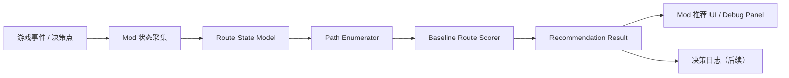

# 架构说明

## 系统目标

项目采用可迭代的分层结构。

- 阶段一：在游戏侧 mod 内实现本地规则型路线推荐核心，先打通可运行 MVP。
- 后续阶段：再拆分为“游戏侧 mod + 本地 Python AI 服务”的双进程结构，把复杂策略逻辑与游戏接入层解耦。

## 已确认运行时事实

基于本机游戏目录 `E:\SteamLibrary\steamapps\common\Slay the Spire 2` 的只读核查，当前已确认：

- 游戏运行时是 Godot + .NET / C#。
- 游戏核心程序集位于 `data_sts2_windows_x86_64/sts2.dll`。
- mod 目录为 `<game>/mods/`。
- mod manifest 使用独立的 `<mod_id>.json`，字段至少包括：
  - `id`
  - `name`
  - `author`
  - `description`
  - `version`
  - `has_pck`
  - `has_dll`
  - `dependencies`
  - `affects_gameplay`
- 社区示例与本机已装 mod 都表明 `ModInitializer` 是当前有效入口方式。

因此，仓库中的“真实游戏侧实现”应当逐步转向 C# 项目；此前 `mod/src/` 下的 Java 实现目前仅作为评分原型与结构参考。

## 游戏侧 mod 的职责

- 识别推荐触发时机，例如地图路线选择、选卡奖励、遗物选择。
- 读取游戏运行时状态，并整理成稳定的内部快照对象。
- 在阶段一中，直接调用本地 baseline 路线评分核心。
- 在后续阶段，将快照序列化为共享 JSON 协议，并向本地 Python AI 服务发起评分请求。
- 将推荐结果转换成游戏内 UI，可展示分数、排名和简短理由。
- 在需要时记录本地决策日志，关联请求、响应和玩家最终选择。

游戏侧 mod 不负责：

- 直接实现主要评分策略。
- 在客户端堆积复杂模型逻辑。
- 代替玩家执行输入或自动完成操作。

## Python AI 服务的职责

Python AI 服务不是阶段一 MVP 的交付前提，而是后续替换本地规则评分器的扩展方向。

- 暴露本地评分接口，接收来自 mod 的 JSON 请求。
- 校验请求协议版本与字段完整性。
- 基于请求生成决策候选，MVP 阶段重点是路线候选。
- 对候选进行 baseline 启发式评分，并生成可读理由。
- 返回排序后的推荐结果，供游戏侧展示。
- 为后续扩展预留选卡、遗物和离线评估能力。

Python AI 服务不负责：

- 直接读取游戏内存或游戏 UI。
- 承担游戏内展示逻辑。
- 在首阶段承担整局代理控制。

## 数据流



### 端到端流程

1. mod 在地图或奖励界面识别出一个“需要建议”的决策点。
2. `state_capture` 模块读取游戏状态，构建 `DecisionSnapshot`。
3. `path_enumeration` 模块从当前节点出发生成可达路径候选。
4. `baseline_scoring` 模块对候选路径执行规则型评分，并生成结构化理由。
5. mod 将结果展示在游戏内 UI 或调试面板中，并可选写入日志。

后续接入 Python 服务时，再把第 3 至第 4 步替换为 JSON 请求/响应链路。

## 协议边界

建议尽早固定两个核心协议对象，阶段一先在本地对象模型中落地，后续再序列化为 JSON：

- `DecisionSnapshot`
  - `schema_version`
  - `decision_type`
  - `run_context`
  - `player_state`
  - `map_state`
  - `options`
- `RecommendationResponse`
  - `schema_version`
  - `decision_type`
  - `recommendations`
  - `service_version`
  - `explanations`
  - `trace_id`

协议目标是“稳定、显式、可演进”。即使内部实现变化，也尽量保持输入输出契约稳定。

## 模块边界

| 模块 | 位置建议 | 职责 | 明确不做 |
| --- | --- | --- | --- |
| 状态采集 | `mod/src` | 读取地图、玩家状态、决策上下文 | 不做评分策略 |
| 传输层 | `mod/src` | JSON 序列化、请求发送、超时与失败处理 | 不做 UI 决策 |
| 推荐展示 UI | `mod/src` / `mod/resources` | 渲染推荐面板、显示分数与理由 | 不做业务评分 |
| API 层 | `python_service/app` | 接口定义、请求校验、响应封装 | 不直接读取游戏状态 |
| 候选生成 | `python_service/app` | 路线候选枚举和剪枝 | 不做游戏 UI |
| 评分逻辑 | `python_service/app` | baseline 启发式评分、解释生成 | 不做输入注入 |
| 共享 schema | `shared/schemas` | 维护请求/响应 JSON 契约 | 不承载运行逻辑 |
| 离线评估 | `tools/eval` | 回放日志、统计效果、比较版本 | 不进入运行时主链路 |

## 目录结构建议

当前阶段保持最小结构，不提前锁死具体构建工具细节：

```text
docs/
  ARCHITECTURE.md
  PROJECT_BRIEF.md
  PROJECT_STATUS.md
  SESSION_HANDOFF.md
  TASK_BOARD.md
mod/
  csharp/
    SkAiRouteAdvisor/
      src/
      dist/
  src/
  resources/
python_service/
  app/
  tests/
shared/
  schemas/
tools/
  eval/
```

说明：

- `mod/csharp/SkAiRouteAdvisor/` 是当前已验证可编译的 StS2 C# mod 骨架。
- `mod/src/` 下的 Java 代码当前作为路线推荐原型保留，用于快速验证评分结构和数据模型。
- `shared/schemas/` 只存放协议定义，不放运行逻辑，避免服务端和客户端契约漂移。
- `tools/eval/` 独立于在线推荐路径，避免实验脚本污染运行时代码。

## 演进原则

- 先让路线推荐链路跑通，再扩展到选卡和遗物。
- 先用 baseline 规则和显式特征，后续再考虑更复杂模型。
- mod 与 Python 服务之间保持低耦合，任何一侧都可以独立替换或升级。
